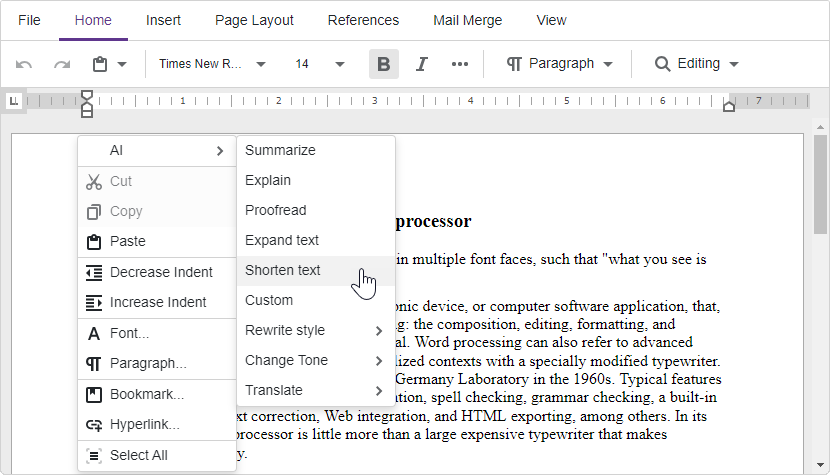
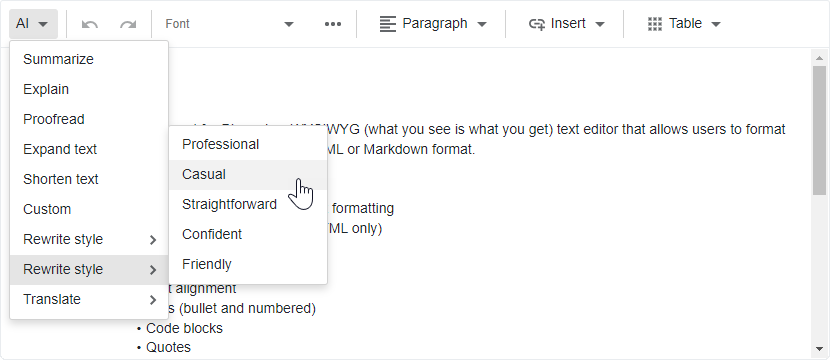

<!-- default badges list -->

[](https://supportcenter.devexpress.com/ticket/details/T1251646)
[](https://docs.devexpress.com/GeneralInformation/403183)
[](#does-this-example-address-your-development-requirementsobjectives)
<!-- default badges end -->
# Rich Text Editor and HTML Editor for Blazor - How to integrate AI-powered extensions

This example enables AI-powered extensions for both the DevExpress Blazor Rich Text Editor and HTML Editor. These extensions supply AI functions designed to process text/HTML content.

## Implementation Details

Both the DevExpress Blazor Rich Text Editor ([DxRichEdit](https://docs.devexpress.com/Blazor/DevExpress.Blazor.RichEdit.DxRichEdit)) and Blazor HTML Editor ([DxHtmlEditor](https://docs.devexpress.com/Blazor/DevExpress.Blazor.DxHtmlEditor)) ship with an `AdditionalSettings` property. You can populate this property with commands and allow users to process editor text as needs dictate. Available commands for both editors are as follows:

* `CustomAISettings` allows user to process text according to a custom prompt.
* `ExpandAISettings` expands the text.
* `ExplainAISettings` explains the text.
* `ProofreadAISettings` proofreads the text.
* `RewriteAISettings` rewrite text using a specified style.
* `ShortenAISettings` shortens the text.
* `SummaryAISettings` summarizes the text.
* `ToneAISettings` rewrite text using a specified tone.
* `TranslateAISettings` translates the text into the specified language.

### Register AI Services

Add the following code to the _Program.cs_ file to register AI services in the application:

```cs
using DevExpress.AIIntegration;

string azureOpenAIEndpoint = Environment.GetEnvironmentVariable("AZURE_OPENAI_ENDPOINT");
string azureOpenAIKey = Environment.GetEnvironmentVariable("AZURE_OPENAI_API_KEY");
...
builder.Services.AddDevExpressAI((config) => {
    var client = new AzureOpenAIClient(
        new Uri(azureOpenAIEndpoint),
        new AzureKeyCredential(azureOpenAIKey));
    config.RegisterChatClientOpenAIService(client, "gpt4o");
    config.RegisterOpenAIAssistants(client, "gpt4o");
});
```

### Enable AI-powered extension for the DevExpress Rich Text Editor 

AI-powered extension for Rich Text Editor adds AI-related commands to the editor's context menu. 

Declare DxRichEdit's `AdditionalSettings` and populate it with commands in the following manner:

```razor
@using DevExpress.AIIntegration.Blazor.RichEdit
@using DevExpress.Blazor.RichEdit

<DxRichEdit DocumentContent="DocumentContent" CssClass="my-editor">
    <AdditionalSettings>
        <SummaryAISettings />
        <ExplainAISettings />
        <ProofreadAISettings />
        <ExpandAISettings />
        <ShortenAISettings />
        <CustomAISettings />
        <RewriteAISettings />
        <ToneAISettings />
        <TranslateAISettings Languages="@("German, French, Chinese")" />
    </AdditionalSettings>
</DxRichEdit>
```



### Enable AI-powered extension for the DevExpress HTML Editor

The AI-powered extension for our HTML Editor adds AI-related commands to the editor's toolbar.

Declare DxHtmlEditor's `AdditionalSettings` and populate it with commands in the following manner:

```razor
@using DevExpress.AIIntegration.Blazor.HtmlEditor

<DxHtmlEditor @bind-Markup="Value" CssClass="my-editor" BindMarkupMode="HtmlEditorBindMarkupMode.OnLostFocus">
    <AdditionalSettings>
        <SummaryAISettings />
        <ExplainAISettings />
        <ProofreadAISettings />
        <ExpandAISettings />
        <ShortenAISettings />
        <CustomAISettings />
        <RewriteAISettings />
        <ToneAISettings />
        <TranslateAISettings Languages="@("German, French, Chinese")" />
    </AdditionalSettings>
</DxHtmlEditor>
```



## Files to Review

* [RichEdit.razor](./CS/DevExpress.AI.Samples.Blazor.Editors/Components/Pages/RichEdit.razor)
* [HtmlEditor.razor](./CS/DevExpress.AI.Samples.Blazor.Editors/Components/Pages/HtmlEditor.razor)
* [Program.cs](./CS/DevExpress.AI.Samples.Blazor.Editors/Program.cs)

<!-- add later
## Documentation

- link
- link
-->

## More Examples

* [AI Chat for Blazor - How to add DxAIChat component in Blazor, MAUI, WPF, and WinForms applications](https://github.com/DevExpress-Examples/devexpress-ai-chat-samples)

<!-- feedback -->
## Does this example address your development requirements/objectives?

[](https://www.devexpress.com/support/examples/survey.xml?utm_source=github&utm_campaign=blazor-ai-integration-to-text-editors&~~~was_helpful=yes) [](https://www.devexpress.com/support/examples/survey.xml?utm_source=github&utm_campaign=blazor-ai-integration-to-text-editors&~~~was_helpful=no)

(you will be redirected to DevExpress.com to submit your response)
<!-- feedback end -->
