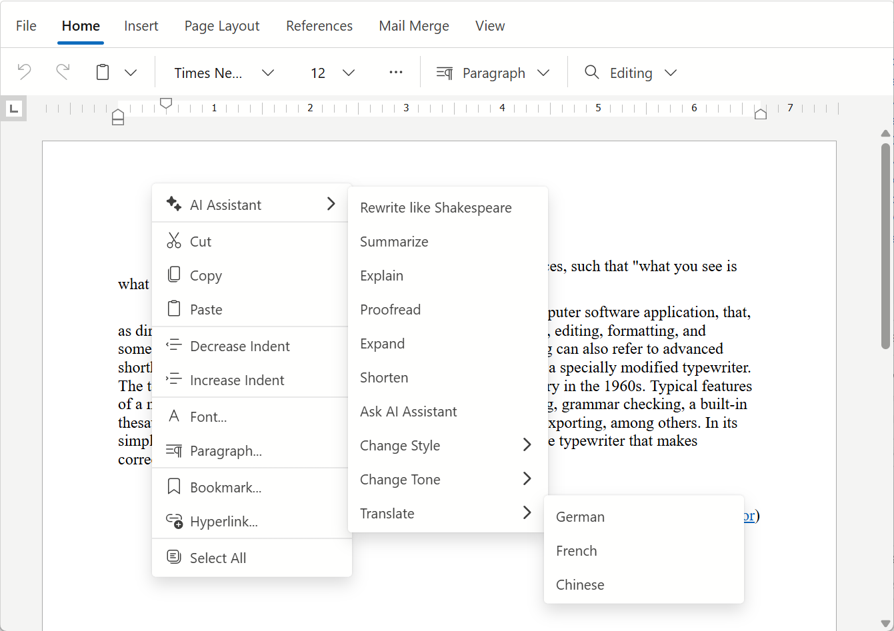
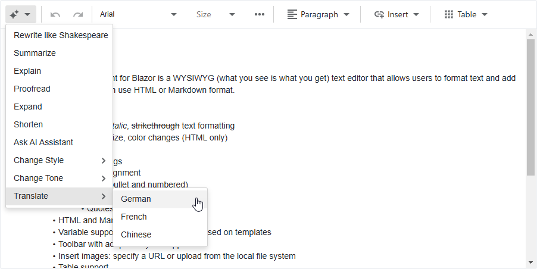

<!-- default badges list -->

[](https://supportcenter.devexpress.com/ticket/details/T1251646)
[](https://docs.devexpress.com/GeneralInformation/403183)
[](#does-this-example-address-your-development-requirementsobjectives)
<!-- default badges end -->
# Rich Text Editor and HTML Editor for Blazor - How to integrate AI-powered extensions

This example enables AI-powered extensions for both the DevExpress Blazor Rich Text Editor and HTML Editor. These extensions supply AI functions designed to process text/HTML content.

## Implementation Details

Both the DevExpress Blazor Rich Text Editor ([DxRichEdit](https://docs.devexpress.com/Blazor/DevExpress.Blazor.RichEdit.DxRichEdit)) and Blazor HTML Editor ([DxHtmlEditor](https://docs.devexpress.com/Blazor/DevExpress.Blazor.DxHtmlEditor)) ship with an `AdditionalItems` property. You can populate this property with commands and allow users to process editor text as needs dictate. Available commands for both editors are as follows:

* **Ask AI Assistant** allows user to process text based on a custom prompt.
* **Change Style** rewrite text using a specified style.
* **Change Tone** rewrite text using a specified tone.
* **Describe Picture** generates the description for an image (for Rich Text Editor only).
* **Expand** expands text.
* **Explain** explains text.
* **Proofread** proofreads text.
* **Shorten** shortens text.
* **Summarize** summarizes text.
* **Translate** translates text into the specified language.

### Register AI Services

> [!NOTE]  
> DevExpress AI-powered extensions follow the "bring your own key" principle. DevExpress does not offer a REST API and does not ship any built-in LLMs/SLMs. You need an active Azure/Open AI subscription to obtain the REST API endpoint, key, and model deployment name. These variables must be specified at application startup to register AI clients and enable DevExpress AI-powered Extensions in your application.

Add the following code to the _Program.cs_ file to register AI services in the application:

```cs
using Azure;
using Azure.AI.OpenAI;
using Microsoft.Extensions.AI;
...
string azureOpenAIEndpoint = Environment.GetEnvironmentVariable("AZURE_OPENAI_ENDPOINT");
string azureOpenAIKey = Environment.GetEnvironmentVariable("AZURE_OPENAI_API_KEY");
string deploymentName = string.Empty;

IChatClient chatClient = new AzureOpenAIClient(
    new Uri(azureOpenAIEndpoint),
    new AzureKeyCredential(azureOpenAIKey)).AsChatClient(deploymentName);
    
builder.Services.AddDevExpressBlazor();
builder.Services.AddChatClient(chatClient);
builder.Services.AddDevExpressAI();
```

> [!Tip]
> Refer to the following help topic for instructions on registering OpenAI, Azure OpenAI, Ollama, and Semantic Kernel: [Register AI Clients](https://docs.devexpress.com/CoreLibraries/405204/ai-powered-extensions#register-ai-clients).

> [!Note]
> We use the following versions of the `Microsoft.Extensions.AI.*` libraries in our source code:
>
> v24.2.6+ | **9.3.0-preview.1.25161.3**
>
> We do not guarantee compatibility or correct operation with higher versions. Refer to the following announcement for additional information: [Microsoft.Extensions.AI.Abstractions NuGet Package Version Upgrade in v24.2.6](https://community.devexpress.com/blogs/news/archive/2025/03/12/important-announcement-microsoft-extensions-ai-abstractions-nuget-package-version-upgrade.aspx).

### Enable AI-powered extension for the DevExpress Blazor Rich Text Editor

AI-powered extension for our Blazor Rich Text Editor adds AI-related commands to the editor's context menu.

You can add [predefined commands](https://docs.devexpress.com/Blazor/DevExpress.AIIntegration.Blazor.RichEdit?v=24.2) or implement custom commands as necessary. This example introduces a **Rewrite like Shakespeare** context menu item.

```csharp
public class ShakespeareAIContextMenuItem : BaseAIContextMenuItem {
    [Inject] IAIExtensionsContainer? aIExtensionsContainer { get; set; }

    protected override string DefaultItemText => "Rewrite like Shakespeare";

    protected override Task<TextResponse> GetCommandTextResult(string text) {
        var customExtension = aIExtensionsContainer.CreateCustomPromptExtension();
        return customExtension.ExecuteAsync(new CustomPromptRequest("Rewrite the following text in William Shakespeare style.", text));
    }
}
```

Declare DxRichEdit's [AdditionalItems](https://docs.devexpress.com/Blazor/DevExpress.Blazor.RichEdit.DxRichEdit.AdditionalItems?v=24.2) and populate it with commands in the following manner:

```razor
@using DevExpress.AIIntegration.Blazor.RichEdit
@using DevExpress.Blazor.RichEdit

<DxRichEdit DocumentContent="DocumentContent" CssClass="my-editor">
    <AdditionalItems>
        <ShakespeareAIContextMenuItem />
        <SummarizeAIContextMenuItem />
        <ExplainAIContextMenuItem />
        <ProofreadAIContextMenuItem />
        <ExpandAIContextMenuItem />
        <ShortenAIContextMenuItem />
        <AskAssistantAIContextMenuItem />
        <ChangeStyleAIContextMenuItem />
        <ChangeToneAIContextMenuItem />
        <TranslateAIContextMenuItem Languages="@("German, French, Chinese")" />
    </AdditionalItems>
</DxRichEdit>
```



### Enable AI-powered extension for the DevExpress Blazor HTML Editor

The AI-powered extension for our Blazor HTML Editor adds AI-related commands to the editor's toolbar.

You can add [predefined commands](https://docs.devexpress.com/Blazor/DevExpress.AIIntegration.Blazor.HtmlEditor?v=24.2) or implement custom commands as necessary. This example introduces a **Rewrite like Shakespeare** toolbar item.

```csharp
public class ShakespeareAIToolbarItem: BaseAIToolbarItem {
    [Inject] IAIExtensionsContainer? aIExtensionsContainer { get; set; }

    protected override string DefaultItemText => "Rewrite like Shakespeare";

    protected override Task<TextResponse> GetCommandTextResult(string text) {
        var customExtension = aIExtensionsContainer.CreateCustomPromptExtension();
        return customExtension.ExecuteAsync(new CustomPromptRequest("Rewrite the following text in William Shakespeare style.", text));
    }
}
```

Declare DxHtmlEditor's [AdditionalItems](https://docs.devexpress.com/Blazor/DevExpress.Blazor.DxHtmlEditor.AdditionalItems?v=24.2) and populate it with commands in the following manner:

```razor
@using DevExpress.AI.Samples.Blazor.Editors.Components.AdditionalItems
@using DevExpress.AIIntegration.Blazor.HtmlEditor

<DxHtmlEditor @bind-Markup="Value" CssClass="my-editor" BindMarkupMode="HtmlEditorBindMarkupMode.OnLostFocus">
    <AdditionalItems>
        <ShakespeareAIToolbarItem />
        <SummarizeAIToolbarItem />
        <ExplainAIToolbarItem />
        <ProofreadAIToolbarItem />
        <ExpandAIToolbarItem />
        <ShortenAIToolbarItem />
        <AskAssistantAIToolbarItem />
        <ChangeStyleAIToolbarItem />
        <ChangeToneAIToolbarItem />
        <TranslateAIToolbarItem Languages="@("German, French, Chinese")" />
    </AdditionalItems>
</DxHtmlEditor>
```



## Files to Review

* [RichEdit.razor](./CS/DevExpress.AI.Samples.Blazor.Editors/Components/Pages/RichEdit.razor)
* [HtmlEditor.razor](./CS/DevExpress.AI.Samples.Blazor.Editors/Components/Pages/HtmlEditor.razor)
* [ShakespeareAIContextMenuItem.cs](./CS/DevExpress.AI.Samples.Blazor.Editors/Components/AdditionalItems/ShakespeareAIContextMenuItem.cs)
* [ShakespeareAIToolbarItem.cs](./CS/DevExpress.AI.Samples.Blazor.Editors/Components/AdditionalItems/ShakespeareAIToolbarItem.cs)
* [Program.cs](./CS/DevExpress.AI.Samples.Blazor.Editors/Program.cs)

## Documentation

* [DevExpress AI-powered Extensions for Blazor](https://docs.devexpress.com/Blazor/405228/ai-powered-extensions?v=24.2)
* [AI-powered Extension for Blazor Rich Text Editor](https://docs.devexpress.com/Blazor/405193/components/rich-edit/ai-integration?v=24.2)
* [AI-powered Extension for Blazor HTML Editor](https://docs.devexpress.com/Blazor/405187/components/html-editor/ai-integration?v=24.2)

## Online Demo

* [AI-powered Extensions: HTML Editor](https://demos.devexpress.com/blazor/AI/AIIntegrationHtmlEditor)
* [AI-powered Extensions: Rich Text Editor](https://demos.devexpress.com/blazor/AI/AIIntegrationRichEdit)

## More Examples

* [AI Chat for Blazor — How to add DxAIChat component in Blazor, MAUI, WPF, and WinForms applications](https://github.com/DevExpress-Examples/devexpress-ai-chat-samples)
* [Blazor Grid and Report Viewer — Incorporate an AI Assistant (Azure OpenAI) in your next DevExpress-powered Blazor app](https://github.com/DevExpress-Examples/blazor-grid-and-report-viewer-integrate-ai-assistant)

<!-- feedback -->
## Does this example address your development requirements/objectives?

[](https://www.devexpress.com/support/examples/survey.xml?utm_source=github&utm_campaign=blazor-ai-integration-to-text-editors&~~~was_helpful=yes) [](https://www.devexpress.com/support/examples/survey.xml?utm_source=github&utm_campaign=blazor-ai-integration-to-text-editors&~~~was_helpful=no)

(you will be redirected to DevExpress.com to submit your response)
<!-- feedback end -->
